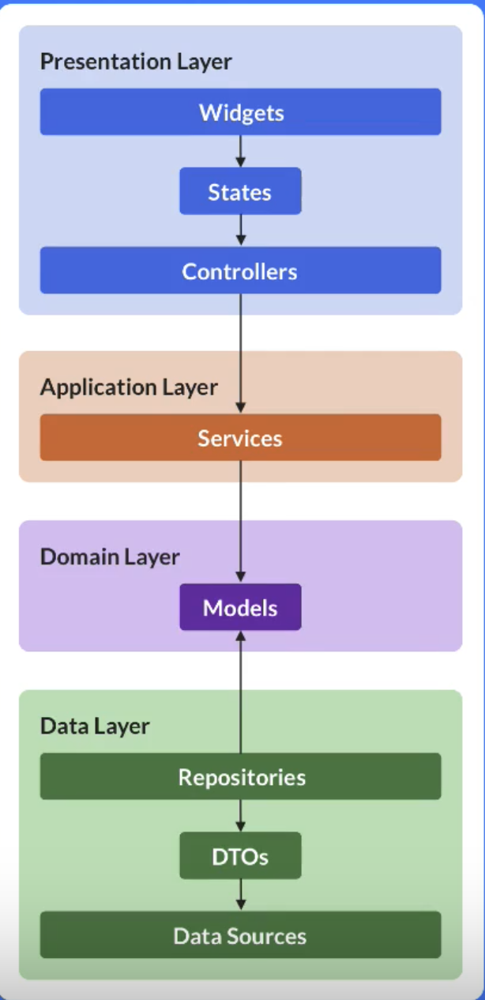
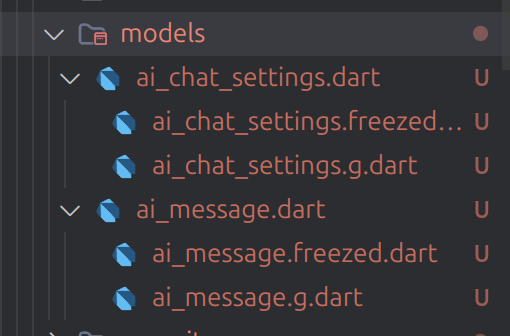

# aichat

A pet project with riverpod arch + firebase auth and firestore

## Architecture

The project follows Clean Architecture principles with clear separation of concerns:



- **Presentation Layer**: Widgets, States, and Controllers (Riverpod)
- **Application Layer**: Services for business logic coordination  
- **Domain Layer**: Core business models and entities
- **Data Layer**: Repositories, DTOs, and Data Sources (Firebase)

## Automated Testing

The project includes comprehensive test coverage:

- **Unit Tests**: Testing business logic and data layer components
- **Widget Tests**: Testing UI components and interactions
- **Golden Tests**: Visual regression testing for UI consistency
- **Integration Tests**: End-to-end testing of complete user flows

## Development Setup

### VS Code File Nesting Configuration

To improve file organization for generated Dart files (`.freezed.dart`, `.g.dart`), add the following to your VS Code `settings.json`:

```json
{
  "explorer.fileNesting.patterns": {
    "*.dart": "${capture}.g.dart, ${capture}.freezed.dart"
  },
  "explorer.fileNesting.enabled": true,
  "explorer.fileNesting.expand": false
}
```

This configuration will:
- Group generated files under their main model files
- Keep the file explorer clean and organized
- Allow expanding grouped files when needed

**Example of file nesting in action:**



**Why this matters**: This project has moved away from creating separate folders for each model and its generated files. Without this VS Code setting, you'll see a cluttered file structure in the models directory.

